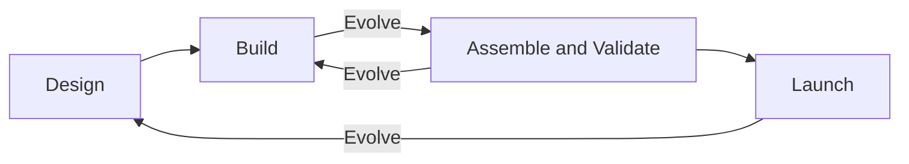

# Develop the Future - High School Program Guide
Content Review
Tim Ubial

## Introduction

### Navigating Pages Resources

Clear overview of what to expect. 👍🏾

### Program Pacing

Consider sticking to *phase* to name the units for consistency. It's a good term to describe the units. They're introduced first as *themes* then switched to *phase*.

## Phases

### Flow

Organizing content into Phases is a great addition. The *Develop the Future* cycle follows the same rhythms as the design workflow that I teach with my Programming students.

I would consider integrating the build and assemble phase together. While students are learning language concepts, they can have some time to work on their individual App Ideas as part of it. 

The illustration below is a way that I can describe what the flow looks like in my head.



I understand that pacing is discussed in the *Program Pacing* section and is ultimately at the teacher's discretion. Adding in a note to give teachers an idea that they can build in time for students to work on their app ideas as they learn the concepts would be extremely useful.

Below is an example of a sequence that integrates Assemble bits into the ***Build*** phase

> 2.1 Constants, Variables, and Types
> 2.2 @State Basics
> 2.3 TextField, SecureField, and TextEditor
> 2.4 Colour, Rectangle, Circle, and Gradient
> **Assemble** Splash/Intro Screen for App Idea
> 2.5 Divider and Spacer
> 2.6 Layout and Style
> 2.7 Control Flow
> 2.8 Image and AsyncImage
> **Assemble** Image in Splash Screen
> ...
> 2.21 TabView
> **Assemble** Implement your second screen using TabView
> ...

I felt that there might have been surplus time during the *App Development* portion which might have given students a signal that it was OK to backload their effort, thinking that they had more than enough time. As a result, there were a group of students who ended crunching without meaning it. Sprinkling ***Assemble*** opportunities for students to work on their own projects during the build phase would help to chunk the work.

### Milestone Projects or Activities

Consider a summative activity, project, or milestone that wraps up the concepts in the phases. It may seem old school to have a "unit project", but these summative evaluations can help teachers with evaluation. One possibility is to call back to the App Design Journal through some lessons in each phase. The App Design Journal can serve as a living document that keeps track of student progress.

## Lessons

The teacher notes are great pieces of information. Consider adding some contrast to draw attention to them.

### Phase 1 - Design

Consider adding a broad overview for each phase that includes the lesson sections.

E.g.

> 1.1 Kickoff
> 1.2 Mac Basics for Developers
> 1.3 Hello SwiftUI - Intro to Xcode and Swift
> ...


#### 1.9 Views, Structures, and Properties

Consider adding note:

* There are some concepts that aren't explicitly explained, like `structs` and `let`. Trust the process; these concepts will be uncovered shortly in a future lesson.

### Phase 2 - Build

There are a dozen lessons the beginning of the phase to the desing portion with ADEs. Consider adding a note to say that teachers can include Design segments where students can focus on building out their app idea.

Overall flow from topic to topic is good. I don't think I would change anything.

The activities are laid out well to reinforce the concepts in each lesson. Consider adding activites that span a number of different concepts. Developer builds could be expanded to incude concepts covered in previous lessons, for example.

The Hackathon is a great idea. 👍🏾

#### 2.1 Constants, Variables, and Data Types

* Consider adding best practices when it comes to declaring or infering types of variables
	* This could be an additional lesson on its own or an extension
	* For example, obvious information like `name` and `count` can be inferred by the compiler
	* When clarity matters or when inference will give an unintuitive data type, declaring type is important
	* A rule of thumb that I typically use is:
		* anything public facing should use an explicit type
		* anything local, private, obvious can use inference
 
```swift
let fraction = 1 / 2  // inferred as an Int = 0
let fraction: Double = 1 / 2
```

#### 2.3 Text Input in SwiftUI

Consider letting students know that the activity is meant to show how a `SecureField` works
* A caveat should be added that code shipped to production should use libraries suited to storing passwords, like the Keychain API, or to use other things like OAuth
* I understand that this might be a little overkill, but will benefit the advanced students to which its targeted
 
#### 2.6 Layout and Style

The product that the students create in this lesson's activity could be a summatively evaluated deliverable.

#### 2.11 Buttons and States

Consider renaming this to **Buttons and State** to align with `@State` properties.

#### 2.12 Loops and Collections

This ties in nicely with 2.13. 👍🏾

#### 2.21 Navigation

Considering the importance of tabs/navigation views, this assignment can be considered as a milestone deliverable that can be summatively evaluated.

### Phase 3 - Assemble

#### 3.1 App Development

Consider putting App Development chunks during the build phase.

### Phase 4 - Launch

User testing workshop is a great idea. Getting students to get others to user their apps gives them an opportunity to look at their apps in a different point of view.

Teacher notes in this section are very insightful.

### Phase 5 - Evolve

#### 5.3 Github

I would consider putting this in Build as an optional near the beginning and preface to teachers that this would be something to seriously consider doing if they're comfortable doing so.

## Closing

Overall it's a significant iteration over last year's version. It leverages what the previous version did well and fills in the gaps appropriately. Content was a strong point already. What this version does is lay it out in a meaningful and flowing way. The teacher notes are a welcome addition; bring them to the fore front. Consider putting App Development pieces in the build section. Consider giving suggestions for milestones in the students' app development process. 