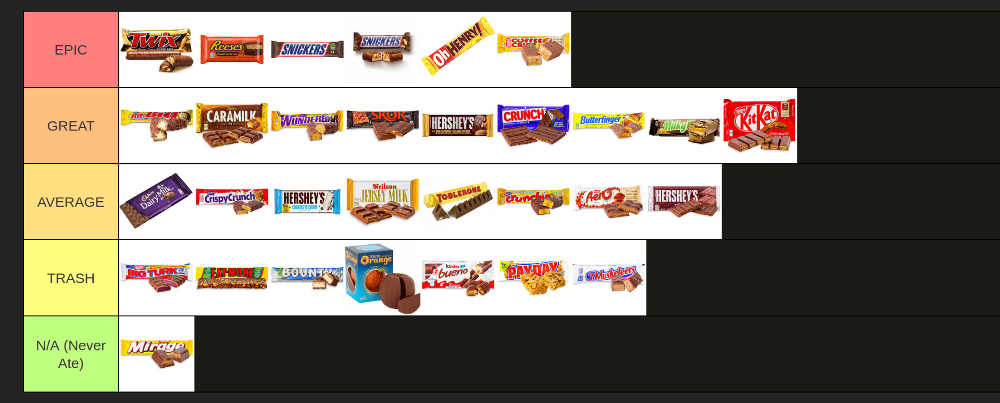

# Weekly Journal
23 October 2025
~~Your name here~~

## Turtle Artist

> What more do you need to do with your Turtle Artist activity to finish?

~~Your reply goes here~~

## Reading Code - Recursion

Consider the function below:

```python
def draw_snowflake(depth: int, length: float):
	"""Draws a snowflake of a given depth recursively."""
	t = turtle.Turtle()
	
	if level > 0:
		for _ in range(5):
			t.forward(length)
			draw_snowflake(level - 1, length * 0.75)
			t.backward(length)
			t.left(360 / 5)
```

What does the function do and how do you know?

~~Your reply goes here~~

How many branches does a snowflake have and how do you know?

~~Your reply goes here~~

## Closing Questions



> Your hot take: use this link to put candy bars in a tier list.
> Screenshot (cmd+shift+4) and drag-and-drop below.

~~Your screenshot goes here~~

> What plans do you have this weekend?

~~Your reply goes here~~
